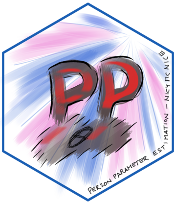

## Woher

Als ich vor vielen Jahren das **PP** package zu schreiben begann, war
für mich Psychometrie alles, was mich interessierte.
Die perfekte Überschneidung von Psychologie und Statistik. 
Aus Testergebnissen alles rauskitzeln, was man bekommen konnte. 
Parameter zu finden für das scheinbar nicht Messbare. Das ist ja
fast das Kerngeschäft eines methodisch arbeitenden Psychologen. 
Latente Konstrukte, Artefakte, die den phantasievollen Schlussfolgerungen
von Psycholog:innen entspringen. Was gibt es schöneres, als diese 
mit statistischen Modellen zu jagen? Richtig: 
Diese Modelle selbst zu implementieren.

Jeder weiß: Personenparameter sind die Stiefkinder unter den Parametern in der IRT.
Jeder will nur skalieren und die Itemparameter schätzen, während die
Personenparameter ihr Dasein im Schatten ihrer großen Brüder fristen. 
Manchmal werden sie sogar abschätzig "Nuisance Parameter" genannt.
Man versucht sie möglichst loszuwerden, definiert sie als Verteilung
oder will sie ganz loswerden, je nachdem welche Schätzmethode man verwendet.
Und verwendet eine Schätzmethode mal explizit die einzelnen $\theta$ (wie bei JML),
dann hat man auch schon einen Bias im Schätzer drin. 

Kommt man aber aus der psychologischen Diagnostik, wie ich, dann will man 
schon des öfteren wissen, wie es denn um die Fähigkeit der gemessenen 
Personen bestellt ist. Dann will man die Personenparameter schätzen. 
Zur Zeit als ich das package geschrieben habe, gab es kaum zugängliche Lösungen,
Personenparameter auf Basis von fixierten Itemparameter zu schätzen.
Diese Aufgabe soll das PP package übernehmen.

Im Grunde existiert das PP package derzeit in der zweiten Version 
(zumindest strukturiert es mein Hirn so).
Die erste Version war eine etwas hilflose Zusammenstellung von 
viel zu vielen R Funktionen, die aus einem gemeinsamen Projekt 
mit der Firma Schuhfried entstanden. Die aktuelle Version 0.6.4-1 entsprang
einer einfachen Nachfrage von [Alexander Robitzsch](https://www.leibniz-ipn.de/de/das-ipn/ueber-uns/personen/alexander-robitzsch), ob ich plane
das PP package auch für das 4-PL Modell zu erweitern, sonst würde
er das selbst machen. Nun, erweitern ist weniger das was ich im 
Kopf hatte. Vielmehr gab mir die E-Mail den Anstoß, alles niederzubrennen
und komplett neu zu gestalten. Als Ergebnis erhob sich das PP package
in seiner jetzigen Gestalt aus der Asche. Inside: Auch Personenparameter
für das 4-PL Modell. Ob das schon jemals gewinnbringend angewandt wurde,
bleibt für mich immer ein Rätsel, weil von das 3-PL Modell gefühlt
mehr Probleme macht, als es Probleme löst.

In weiterer Folge stieß [Jan Steinfeld](https://jansteinfeld.github.io/) 
als Autor hinzu, nachdem ich ihn überzeugt hatte,
dass Person-Fit Indices doch sehr bereichernd wären für das PP-package.
(Infit und Outfit klingt einfach geil.)
Schon damals gab es immer wieder Probleme beim Upload nach CRAN: UBSAN-Errors.
Eine schreckliche Sache. Der genaue Grund ist mir entfallen, vermutlich
eine Mischung aus steigendem Desinteresse, mich mit einer Sache zu
beschäftigen, die inzwischen weit entfernt meiner täglichen Arbeit liegt,
und den fiesen UBSAN-Errors (eventuell gab es auch noch E-Mails von einem CRAN
Guy: "we write the manuals, you read them."), aber ich bat Jan 
das package zu maintainen. Dankenswerterweise übernahm er als Maintainer
und so fiel das package nicht der Update-Sense auf CRAN zum Opfer.

Die Jahre zogen ins Land. Vor einigen Tagen hab ich mir gedacht: Ich könnte mal
Claude-Code auf PP loslassen und checken, ob sich irgendein Verbesserungsbedarf
besteht am package. Gleich vorweg: Es ist immer gut, sowas zu machen,
wenn man schon vorher weiß, dass es so ist. Ich wusste, es besteht Bedarf.
Ich kann mich an kaum eine Funktion im Detail erinnern, spüre aber noch
die Unzufriedenheit darüber, wie ich die C++ Optimierung umgesetzt habe.
Nicht weil ich mich jetzt mit C++ besser auskennen würde,
nicht weil ich mich jemals mit C++ ausgekannt habe, sondern weil ich 
aus irgendwelchen schlechten Gründen nicht horizontal (pro Person) 
sondern vertikal (pro Item) optimiert habe - zumindest das hab ich mir gemerkt.
 However. Dass Claude Code
dann 6 Bildschirmseiten "Verbesserungsbedarfe" gefunden hat und dazu noch ein paar handfeste Fehler,
dachte ich, dass es Zeit wird für eine **PP Version 3.0.** 
So deprimierend es ist, sein eigenes Werk durch einen KI-Agent zerlegt zu sehen,
so sehr ich gehofft habe, dass meine Arbeit am gefühlten Höhepunkt meiner IRT-Einsichten
mir fehlerfrei von der Hand gegangen ist, so sehr ich stolz
war auf mein Werk, so sehr konnte ich mich nicht verstecken vor Claudes kaltem Charme.
Der Claude Sugar-Coded ja nichts. Da steht dann einfach "Fehler".
Und dann nochmal und dann nochmal. 

## Wohin

Tja, jetzt hab ich mir gedacht, ich kann das alles beim PP package still und 
heimlich korrigieren und es dann als "Update" verkaufen. Was heißt "ich"? 
Claude könnte das viel besser. Einfach go! Ich trinke Kaffee oder schau
gegen die Wand.
Aber es ist halt auch nur der halbe Spaß (egal wie schön die Wand ist).
Man muss ja alles refactoren. Die Zündhölzer liegen bereit.
Nein, ich will das nicht alleine machen. Beim Drüberlesen bin ich mir sicher,
nicht mal alles zu verstehen, was geändert werden muss oder sollte.
Ja, er findet auch Sachen, die nicht falsch sind aber nicht optimal rennen
in Funktionen an die ich mich nicht mehr erinnern kann.

Also hab ich mal beschlossen, dass ich noch was dazulernen will. 
Ich will Claude wie einem "netten" übermotivierten Kollegen begegnen,
der mir sehr gerne erklärt, was falsch ist und warum man es anders machen sollte
ohne mich zu shamen, um es dann selbst zu korrigieren oder mir bei der Korrektur 
assistiert. Oft schreibt er zu viel. Dies und jenes könnte man noch machen.
Ja gut, aber komm. Wenn du so langsam wärst wie ich, Claude, würdest du das auch
nicht machen wollen. Als irgendein Chatbot kann man leicht reden. 

Naja. Ziel ist es jedenfalls, meinen Blog zu nutzen, um die Erkenntnisse zu teilen,
oder, was viel realistischer ist, weil tbh. das liest hier eh keiner,
für mich den ganzen Prozess zu dokumentieren, um mich wieder mehr "in touch" mit
meinem eigenen package zu bringen, das ich sehr vernachlässigt habe. 
Außerdem soll es für eine Art "Verbindlichkeit" sorgen, denn wenn hier steht, dass ich es mache,
 sollte ich es auch machen, sonst: PEINLO. 

Ok. Gehts mir nicht am Wecker damit, weil vielleicht freut mich das refactoren morgen 
eh schon nicht mehr!

Ciao!

